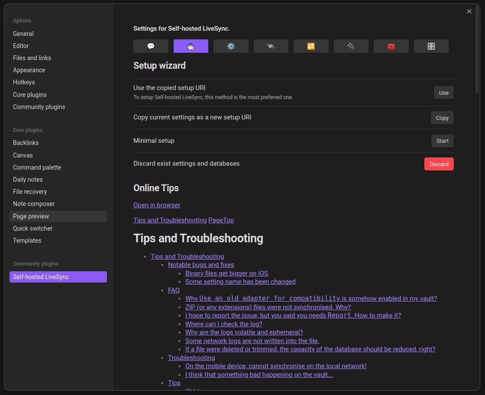
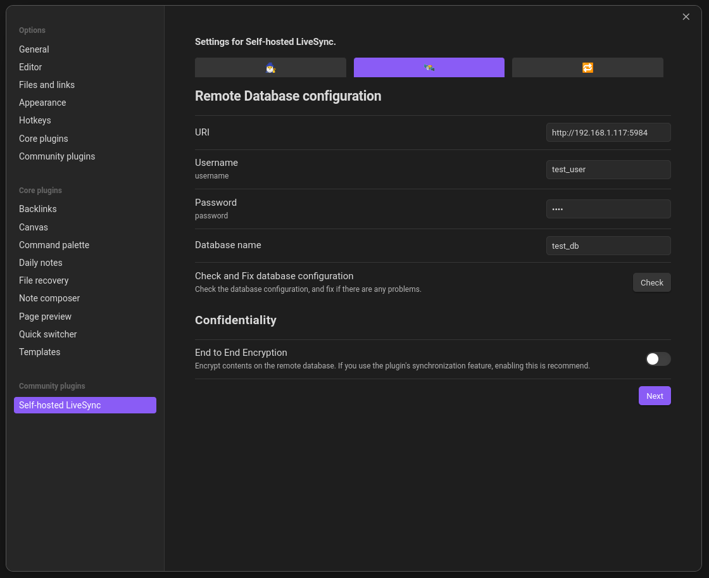
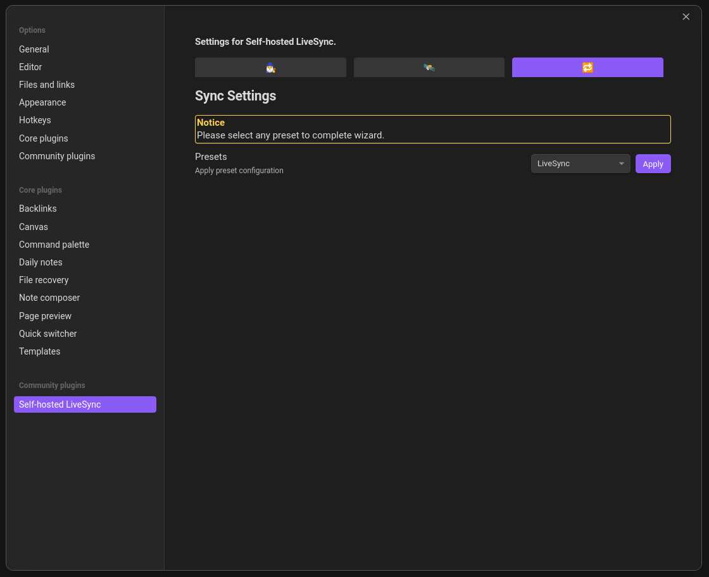
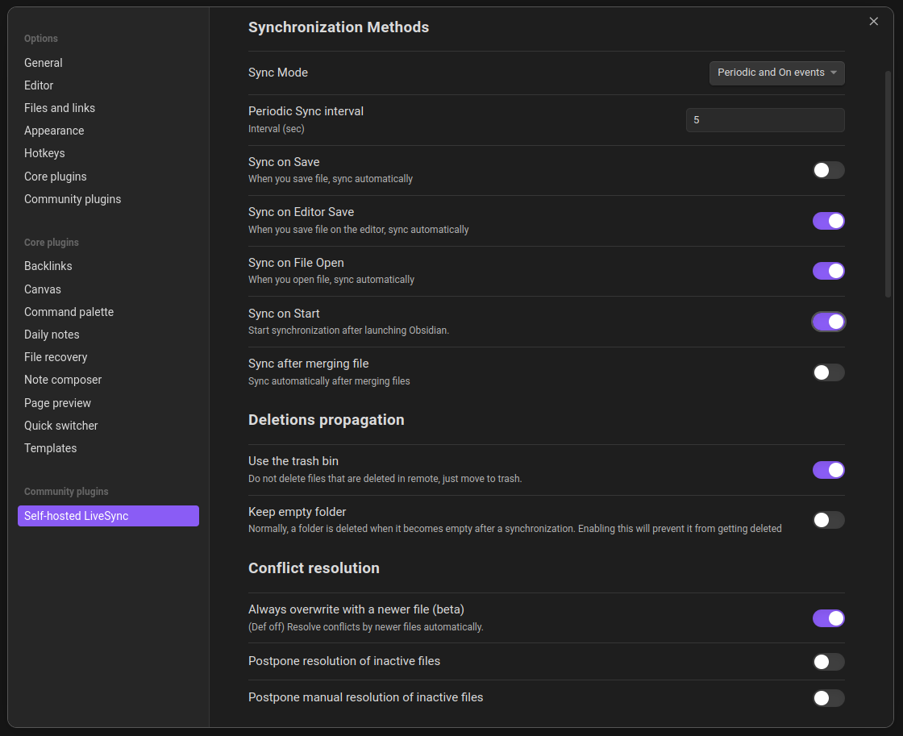

# A quick install script for setting up a collaborative obsidian vault locally

Obsidian-sync is an install and configuration script to run the couchdb of [vrtmz's Self-hosted LiveSync](https://github.com/vrtmrz/obsidian-livesync/).

## Download and use

`Soon`

## Setup the client plugin to use obsidian collaboratively

In order to work on the same remote vault everyone wanting to takes notes with will have to log as the same user and to the same couchdb as you.

In this example, this is our credentials :

- user : test_user
- password : test
- database name : test_db
- URI : `http://192.168.1.117:5984`

> [!IMPORTANT]
> On the client side you will have to ask someone for the credentials, theses won't work.

First start the plugins wizard in the settings tab, and press `start` for the minimal setup.

Then this is where you will put the credentials.

> [!TIP]
> You can press the button `check` to see if you are connected to the couchdb database.

Then you can pass this pannel, i will give you a configuration i like later.

## My personnal "Sync Settings" to work with others

Go to the plugin's settings and cick on the sync tab (the 5th from the left).

- Sync Mode => <code style="color: purple;">"Periodic and On events"</code>
- Periodic Sync interval => <code style="color: purple;">5<code/>
- Sync on Save => <code style="color: red;">Off<code/>
- Sync on Editor Save => <code style="color: green;">On<code/>
- Sync on File Open => <code style="color: green;">On<code/>
- Sync on Start => <code style="color: green;">On<code/>
- Sync after merging => <code style="color: red;">Off<code/>
`----------------------------------------------------------`
- Use the trash bin => <code style="color: green;">On<code/>
- Keep empty folder => <code style="color: red;">Off<code/>
`----------------------------------------------------------`
- Always overwrite with a newer file => <code style="color: green;">On<code/>
- Postpone resolution of inactive files => <code style="color: red;">Off<code/>
- Postpone manual resolution of inactive files => <code style="color: red;">Off<code/>

